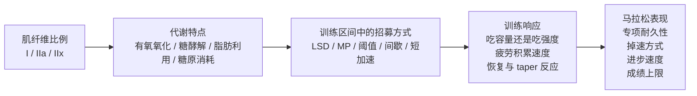

# 快慢肌比例与马拉松：从代谢逻辑到训练分型

## 这篇文章要解决的三个问题

围绕快慢肌比例，马拉松跑者真正关心的通常不是“我是不是天赋不行”，而是更具体的三件事：

1. **不同肌纤维比例的人，训练上会表现出什么自然倾向？**
2. **对应的合理训练安排是什么？**
3. **最终在马拉松的进步速度和天赋上限上，会体现出多大差异？**

要把这三个问题讲清楚，必须先把底层逻辑讲透：

**肌纤维类型 -> 能量代谢 -> 训练区间中的纤维招募 -> 对训练刺激的响应 -> 马拉松专项表现**

换句话说，快慢肌不是一个孤立标签，而是一整套训练和比赛逻辑的入口。

---

## 一、先把主线立住：马拉松不是“纯慢肌比赛”，而是“慢肌主导、IIa 决定上限表达”的项目

先看一张总图。

这条主线里，最容易被误解的一点是：

> 马拉松当然以 I 型纤维主导，但真正决定你能否把能力“表达出来”的，不只是慢肌多不多，还包括 IIa 能否在较高有氧压力下长期参与而不失控。

所以，马拉松不是“慢肌越多越好”的单变量游戏，而是：

- I 型纤维提供**长时间稳定输出的底盘**
- IIa 提供**更高配速下的专项耐久与动作维持能力**
- IIx 如果过早主导，会提高代谢成本，但在神经肌肉刺激中仍有价值

这也是为什么真正有训练价值的问题，从来不是“我是快肌型还是慢肌型”，而是：

- 我更适合通过**堆容量**变强，还是通过**提高质量训练密度**变强？
- 我更容易在 **LSD / MP / 阈值 / 间歇** 里吃到哪一类红利？
- 我的马拉松问题主要来自**代谢能力**，还是来自**肌肉耐久性**？

---

## 二、三类肌纤维分别意味着什么

在进入训练安排之前，需要先看清三类纤维的生理功能。

| 类型 | 主要代谢倾向 | 主要功能特点 | 在马拉松中的典型作用 | 训练上的主要矛盾 |
| --- | --- | --- | --- | --- |
| I 型（慢肌） | 有氧氧化、脂肪氧化、乳酸再利用 | 抗疲劳、可持续输出强 | 负责长时间稳定输出，是比赛主体底盘 | 容易容量足够，但速度储备和动作张力不足 |
| IIa 型 | 有氧 + 糖酵解混合 | 较高配速下仍能持续工作 | 负责 MP、阈值、上坡、后程动作维持 | 必须被训练成“高配速下也能持续工作”，而不是只会拉高代谢压力 |
| IIx 型 | 高速糖酵解、磷酸原供能 | 爆发快、疲劳快 | 不应主导专项输出，但对短加速、坡冲、神经刺激有价值 | 主导性过高时，专项配速的可持续性会变差 |

### 1. I 型纤维：马拉松的主体底盘

I 型纤维的核心特点很明确：

- 收缩速度慢
- 峰值力量相对较低
- 线粒体密度高
- 毛细血管密度高
- 氧化酶活性高
- 抗疲劳能力强

它最适合做的事，就是**低波动、长时间、有氧主导的持续工作**。

这就是为什么长距离跑者、尤其是高水平耐力运动员，通常会有更高比例的 I 型纤维。Costill 等 1976 年对精英耐力跑者的经典活检研究发现，精英长跑运动员平均慢肌比例非常高，这说明耐力项目与 I 型纤维占优之间，确实存在明确关联。[^1]

但这里要立刻补一个边界：

> 慢肌占优是耐力项目的常见基础，不等于慢肌比例本身就能独立解释 elite 内部的成绩差距。

Fink 等 1977 年对 elite 跑者的研究已经提示，在高水平群体内部，真正拉开差距的，并不只是纤维比例本身，而是它如何与酶活性、代谢能力、训练质量一起工作。[^2]

### 2. IIa 型纤维：决定马拉松专项能力能不能被“顶住”的关键

IIa 经常被低估。

很多人一谈快肌，就直接把它和短跑绑定。但 IIa 和 IIx 完全不是一回事。IIa 的核心价值在于：

- 比 I 型更快、更有力
- 同时保留不错的氧化能力
- 在较高强度下仍能持续参与
- 能承担阈值、马拉松专项高端、上坡和后程动作稳定任务

对马拉松来说，IIa 的作用不是“冲刺”，而是：

> 当配速上到 MP、阈值、逆风、上坡、后程强行维持动作质量这些情境时，你还能不能继续以相对可控的代谢成本工作。

这也是为什么很多看起来“不是慢肌王”的跑者，仍然可以跑出很高水平的马拉松：

- I 型纤维负责稳定输出
- IIa 负责把更高强度下的输出维持住

如果 I 型是底盘，那么 IIa 更像是**把底盘转换成比赛速度的变速箱**。

### 3. IIx 型纤维：在马拉松里不该主导，但也不能完全丢掉

IIx 是最典型的高速糖酵解型纤维：

- 收缩最快
- 爆发力最强
- 疲劳也最快
- 最不适合长时间主导马拉松专项输出

但它并不等于“马拉松无用”。

IIx 的价值主要体现在：

- 短促加速
- 坡冲
- 神经肌肉招募
- 速度感和动作张力维持

对马拉松训练而言，更合理的方向不是让 IIx 在专项配速里承担更大工作量，而是：

- 降低它在长时间专项输出中的主导性
- 通过训练把更多 IIx 往 IIa 方向推动
- 只在需要神经肌肉刺激的训练里保留它的价值

Plotkin 等 2021 年的综述与更早的 Pette & Staron 系列综述都支持这一点：训练最常见的纤维型转变，是 **IIx -> IIa**，而不是大规模把 II 型“洗成” I 型。[^3][^4][^5]

---

## 三、为什么肌纤维比例会转化成训练倾向：关键在于代谢，而不是标签

如果只停留在“慢肌耐力强、快肌爆发强”，几乎没有训练价值。

真正有价值的是把它放进能量代谢框架里。

### 1. 能量系统不是轮流工作，而是同时存在、占比不同

跑步时，人体始终同时调用三类供能系统：

1. **磷酸原系统（ATP-PCr）**：供能最快，但持续时间最短
2. **糖酵解系统**：供能速度快，适合更高强度输出，但副产物管理压力更大
3. **有氧氧化系统**：供能速度较慢，但持续时间最长

区别不在于“哪个系统开机、哪个系统关机”，而在于：

- 不同配速下，哪类系统占主导
- 随着持续时间延长，系统之间如何重新分配

马拉松主体当然是**有氧系统主导**，但这并不等于：

- 没有糖酵解参与
- 没有快肌参与
- 不需要高强度训练

真正决定马拉松表现的，是下面两件事：

- 能否长期维持高有氧通量
- 能否尽量延后糖酵解压力失控的时间点

### 2. 不同纤维，更偏向不同代谢任务

#### I 型纤维更偏：

- 有氧氧化
- 脂肪氧化
- 长时间糖原节约
- 乳酸再利用

这意味着慢肌占优的人，通常更擅长：

- 轻松跑
- LSD
- 长时间稳态输出
- 高训练频率和高总量带来的累积适应

#### IIa 型纤维更偏：

- 有氧 + 糖酵解混合型输出
- 较高配速下继续工作
- 阈值与 MP 上沿的持续输出

这意味着 IIa 质量越高，越容易在下面这些场景里表现稳定：

- MP 配速长期维持
- 阈值训练
- 后程不掉动作
- 上坡、逆风、节奏波动中不崩

#### IIx 型纤维更偏：

- 高速糖酵解
- 磷酸原供能
- 爆发性输出

如果一个跑者在专项配速里过早大量依赖 IIx，通常会出现：

- 糖酵解压力更早上升
- 糖原消耗速度更快
- 长时间维持变差
- 比赛后半程掉速更明显

### 3. 训练倾向，本质上是“你更依赖哪种代谢路径完成训练”

所以，不同肌纤维比例的人，训练上会出现很自然的分化：

- **偏慢肌的人**：更容易从容量、LSD、MP、次阈值这种“长期稳定输出型训练”中获益
- **偏快肌 / IIa 的人**：更容易在阈值、间歇、坡冲、力量训练中快速出反应，但若容量建设不够，马拉松专项耐久性会落后

这就是“自然倾向”真正的含义。

不是说谁只能练一种，而是说：

> 同样一套训练，对不同类型的人，收益和代价并不对称。

---

## 四、不同肌纤维比例的人，在马拉松训练中通常会表现出什么自然倾向

这一节开始进入训练安排。

先给一个总览表，再逐项展开。

| 类型 | 常见自然倾向 | 最容易进步的方向 | 最容易出现的问题 | 训练上的第一原则 |
| --- | --- | --- | --- | --- |
| 慢肌占优 | 吃高频、高量、长稳态训练 | LSD、MP、次阈值、长期容量建设 | 速度储备不足、课表越练越平 | 保住容量优势，同时补上速度和动作质量 |
| 相对均衡 | 对大多数训练都能有响应 | MP + 阈值 + 适量间歇的组合 | 容易练得“什么都有一点，什么都不够深” | 明确阶段主线，避免平均用力 |
| 快肌 / IIa 占优 | 对高配速、短间歇、力量、坡冲反应快 | 阈值、间歇、力量、taper 后表现 | 跑量堆快时容易疲劳积累，MP 和长距离耐久性不足 | 容量增长更保守，长期保留 MP 与长距离专项 |

### 1. 慢肌占优型：更容易“慢慢练出很强的马拉松”

这类跑者往往有几个非常典型的特征：

- 周跑量上来后状态更稳
- 轻松跑、LSD、MP 训练的收益持续累积
- 后程耐久性通常更好
- 阈值、次阈值训练也能稳定吸收

这类人最容易犯的错，是以为自己只需要继续加量。

实际上，慢肌占优型最常见的问题不是有氧底盘不够，而是：

- 速度储备不足
- 更高配速下动作张力不足
- 课表长期过平
- 马拉松专项能力有了，但上限抬得慢

#### 更合理的训练安排

如果是慢肌占优型，训练的主框架通常应该是：

- **容量做主线**：轻松跑、LSD、MP、次阈值是主菜
- **阈值做桥梁**：防止只有耐力，没有更高速度下的稳定输出能力
- **少量高强度做补丁**：用短间歇、坡冲、力量训练保住神经肌肉质量

一句话概括：

> 慢肌占优型，不怕没有底盘，怕的是只有底盘。

### 2. 均衡型：训练弹性大，但最怕“平均主义”

均衡型跑者的优势是：

- 轻松跑、MP、阈值、间歇通常都能练
- 不太会在某一类训练上完全失灵
- 容易建立比较完整的能力模型

但问题也在这里。

均衡型最常见的错误是：

- 课表看起来很完整
- 每一项都练到一点
- 但每一项都不够深

在马拉松周期里，均衡型更需要做的是明确阶段主线，例如：

- 前期以容量和 MP 为主
- 中期加入阈值作为能力抬升
- 后期减少非必要高强度，强化专项耐久

一句话概括：

> 均衡型最大的风险，不是偏科，而是“什么都练，什么都不够锋利”。

### 3. 快肌 / IIa 占优型：高刺激反应快，但专项耐久最需要刻意建设

这类跑者往往最容易出现的现象是：

- 高配速训练容易有成就感
- 力量训练、坡冲、短间歇反应明显
- taper 后状态弹得快
- 但一旦跑量堆太快，容易出现疲劳积累、动作发木、长距离后程掉速

这类人最常见的问题不是速度不够，而是：

- MP 持续能力不够
- 长距离耐久性不够
- 局部肌肉负荷管理不够
- 糖原管理压力更高

#### 更合理的训练安排

快肌 / IIa 占优型，最重要的不是压掉自己的强项，而是防止强项喧宾夺主。

训练安排上通常更合理的思路是：

- **跑量增长更保守**：不要照抄极端耐力型跑者的堆量方式
- **MP 和长距离专项必须长期存在**：这是最需要补的短板
- **阈值训练不能断**：它能把 IIa 训练成更适合长时间工作的状态
- **间歇、坡冲、力量训练保留，但只占辅助位置**

一句话概括：

> 快肌 / IIa 占优型，不是不能跑好马拉松，而是必须更刻意地把强项服务于专项，而不是让强项替代专项。

---

## 五、把训练放进马拉松区间里看：每个区间到底在练什么

这一节的目的，是把上面的“倾向”落到训练处方。

| 训练区间 | 大致相对强度 | 主要纤维参与 | 主要代谢特点 | 对马拉松的核心价值 | 哪类人最容易受益 |
| --- | --- | --- | --- | --- | --- |
| 轻松跑 / LSD | 明显慢于 MP | I 型为主 | 有氧氧化、脂肪利用 | 建容量底盘、提高长期稳定输出能力 | 慢肌占优型最容易吃满红利，但快肌型更需要认真补 |
| MP 区间 | 目标全马配速及小幅浮动 | I 型主导，IIa 协同 | 高有氧通量下维持输出、控制糖原消耗 | 直接建立专项耐久性与比赛配速能力 | 三类人都必须做，快肌型更不能缺 |
| 阈值 / 次阈值 | 快于 MP，接近半马到 10K 节奏 | IIa 明显参与 | 高有氧通量 + 可控糖酵解压力 | 提高 MP 区间从容度与上限 | 慢肌型补上限，快肌型练可持续性 |
| 间歇 / VO2max | 明显快于阈值 | IIa 到部分 IIx | 更强氧输送压力 + 更高糖酵解参与 | 抬高天花板，保留高配速动作质量 | 快肌型反应更快，慢肌型更该谨防完全缺失 |
| 短加速 / 坡冲 / strides | 时间短、恢复足 | IIa / IIx 神经招募 | ATP-PCr 为主 | 保持动作张力、步频与神经肌肉质量 | 三类人都需要，慢肌型尤其不能省掉 |

### 1. LSD：不是只练耐力，而是在练“低成本长时间输出”

LSD 的核心不是慢，而是：

- 让 I 型纤维长时间稳定工作
- 提升脂肪利用能力
- 建立长时间低波动有氧输出
- 提高肌肉、肌腱、结缔组织对时长的耐受

对慢肌占优型来说，LSD 更容易被吸收；对快肌 / IIa 占优型来说，LSD 更像是必须补的作业。

### 2. MP：马拉松训练最关键的区间

MP 的核心价值是：

- 把 I 型与 IIa 放到真实比赛代谢压力里协同工作
- 训练糖原管理
- 训练长时间动作稳定性
- 训练真正的专项耐久

很多半马强、全马弱的跑者，本质上不是“不会跑快”，而是 **IIa 会发力，但不会长期以马拉松方式工作**。

### 3. 阈值：不是替代 MP，而是给 MP 提高“从容度”

阈值区间主要训练：

- IIa 在高有氧压力下的工作能力
- 乳酸生成与清除平衡
- 更高强度下的稳定输出能力

它对慢肌型的重要性在于抬上限，对快肌型的重要性在于把“会快”变成“会持续快”。

### 4. 间歇：重要，但最容易喧宾夺主

间歇可以：

- 抬高能力天花板
- 提高氧输送压力
- 保持高配速动作质量

但对马拉松来说，它的问题也很明显：

- 反应快
- 成就感强
- 容易让跑者误以为“快就是对”

尤其快肌 / IIa 占优型，更容易被这一类训练“带偏”。

### 5. 短加速与坡冲：是神经肌肉维护，不是可有可无的小料

这一类训练并不解决专项耐久本身，但能解决一个非常关键的问题：

- 不让长期耐力训练把动作张力、步频质量、神经驱动全部磨平

所以它们不是“短跑选手专属”，而是马拉松跑者避免动作钝化的重要手段。

---

## 六、LSD 中的能量补给：真正要理解的是“谁在承担能量任务”

这一节不直接给处方，而是把推导补给差异所需要的原理讲清楚。

因为 LSD 中的补给问题，本质上不是“跑 30 公里要不要吃胶”这么简单，而是：

> 在长时间纯有氧输出里，究竟是哪一类纤维在承担主要工作；外源碳水进入后，又改变了哪些纤维的糖原压力、动作稳定性和训练质量。

只要把这一层看懂，很多具体补给安排其实是可以自己推导出来的。

### 1. LSD 的补给问题，本质上是在管理三件事

LSD 中补不补、补多补少，真正影响的是三件事：

1. **哪类纤维承担主要输出**
2. **糖原压力在什么时候显著上升**
3. **训练最后留下的是目标适应，还是额外透支**

所以，LSD 补给从来不只是胃里有没有糖，而是一次对：

- 纤维招募
- 底物利用
- 训练质量
- 恢复成本

的联合调控。

### 2. 直接证据：长时间耐力运动中的糖原消耗，具有明显纤维特异性

Asp 等 1999 年对马拉松跑者的研究发现，马拉松后肌糖原消耗明显，而且不同糖原形态与纤维类型的恢复并不一致；赛后第 2 天，I 型纤维中的糖原仍然很低。[^6]

这说明：

- 马拉松与长时间长距离训练，绝不是“全身平均耗能”
- 主要承担输出任务的纤维，会表现出更强的局部糖原消耗与恢复压力

另一条非常关键的证据来自 De Bock 等 2007 年：在约 2 小时、75% VO2max 的耐力运动中，训练前与训练中摄入碳水，可以节约 **IIa 纤维**中的糖原。与此同时，De Bock 等 2005 年也发现，空腹状态下运动更容易促进 **I 型纤维**内脂滴分解。两条证据放在一起，正好说明：长时间耐力训练里的外源碳水供应，会改变不同纤维承担能量任务的方式。[^7][^8]

这条证据特别重要，因为它提示：

> 外源碳水并不只是改善“整体感觉”，而是会改变某些纤维是否需要继续动用自身糖原。

### 3. 为什么同样叫纯有氧 LSD，不同人面对的是不同的局部代谢压力

这里是最关键的推导点。

表面上看，纯有氧 LSD 的强度不高，似乎大家面对的是同一堂课。但放到肌纤维层面，并不是这样。

#### 对慢肌占优型来说

更常见的情况是：

- I 型纤维能长时间稳定承担主体工作
- 有氧氧化与脂肪利用占比较高
- 训练中更容易维持低波动输出
- 在相同总时长下，较不容易提前把 IIa 推到更高糖原压力中

这意味着：同样一堂纯有氧 LSD，慢肌占优型通常更有空间把训练维持在“真正的纯有氧”状态里。

#### 对快肌 / IIa 占优型来说

更常见的情况是：

- 前段可能也能维持纯有氧
- 但随着时长拉长，或配速轻微漂移，IIa 更容易提前承担更多工作
- 一旦 IIa 参与比预想更深，糖原压力会上升得更快
- 训练后半段更容易出现主观强度上升、动作质量下降、局部肌肉疲劳先于心肺出现

这意味着：同样一堂纯有氧 LSD，对快肌 / IIa 占优型来说，更容易从“稳定纯有氧输出”滑向“靠额外局部代谢成本维持完成”。

这就是为什么补给不能一刀切。不是因为某一类人“更娇贵”，而是因为：

> 他们在同样课表里，局部纤维面对的糖原压力并不对称。

### 4. LSD 补给真正应该围绕什么决策

真正有用的判断，不是先问“我今天吃几根胶”，而是先问：

1. 这堂课的目标是什么？
   - 纯容量
   - 脂代训练
   - 时长耐受
   - 后半程稳定性
   - 为 MP 长距离做铺垫
2. 训练后半程，是否希望仍然保持较好的动作质量和稳定性？
3. 这堂课结束后，希望留下的是“专项适应”，还是“更深的代谢透支”？
4. 自己在长时间训练里，是更容易稳定控强度，还是更容易后段漂移？

把这几个问题放在前面，补给逻辑才不会错位。

### 5. 先按 LSD 类型分，再按纤维倾向理解补给原则

下面这张表不提供现成配方，只讲原理。

| LSD 类型 | 训练目的 | 更需要被保护的东西 | 补给逻辑的关键分歧 |
| --- | --- | --- | --- |
| 纯有氧轻松 LSD（全程明显低于 MP） | 建容量、练脂代、堆时长 | 低波动有氧输出 | 关键不是“尽量不补”，而是避免后段从纯有氧滑到硬撑完成 |
| 中长时间稳态 LSD | 在轻松与专项之间搭桥 | 后半程动作与代谢稳定性 | 一旦训练后段质量重要，补给就不能只看前半程感觉 |
| 带 MP 段或进阶后半程的长距离 | 训练专项耐久、糖原管理与后程稳定 | 专项质量 | 此时补给更接近“保护专项输出”，而不是“单纯提供热量” |
| 超过 2.5 小时的长距离 | 训练时长耐受与补给系统 | 后段训练信号和恢复成本 | 补给不再只是可选项，而是在决定这堂课是适应还是透支 |

这一层推导的重点在于：

- 时长越长，纤维特异性糖原压力越重要
- 后半程训练质量越重要，外源碳水的价值越大
- 越容易在后段把 IIa 拉进来工作的人，越需要用补给保护训练信号

### 6. 为什么“补给不足但跑完课表”和“补给合理地跑完课表”，训练效果并不一样

这是很多人最容易误判的地方。

表面上看，两次训练都完成了同样的距离和时长；但在肌纤维层面，它们可能完全不是同一堂课。

#### 补给合理时，更可能留下的信号是：

- I 型纤维长时间稳定工作
- IIa 在需要时参与，但不过早承受过高糖原压力
- 后半程动作质量更稳
- 训练目标更接近“低成本长时间输出能力”
- 恢复成本相对更可控

#### 补给不足时，更可能留下的信号是：

- 后半程局部糖原压力过快抬升
- 本来应该保持纯有氧的训练，逐渐被更高的局部代谢成本污染
- 动作开始掉线，主观强度开始漂移
- 训练从“建能力”转向“证明我能扛”
- 后续训练周的恢复和连续性受损

换句话说：

> 训练效果不能只按“是否跑完课表”判断，而要看你是以什么纤维代价、什么代谢代价跑完的。

### 7. 为什么补给不足时，两类人受到的影响会不对称

#### 慢肌占优型

如果补给不足，通常更常见的结果是：

- 训练仍然可能成立
- 仍能获得一部分时长耐受与脂代刺激
- 但后半程质量下降，恢复代价上升

也就是说，慢肌占优型更常见的问题，不是训练立刻变味，而是：

> 这堂课还能完成，但它更像“有代价的完成”，而不是“高质量的完成”。

#### 快肌 / IIa 占优型

如果补给不足，更常见的结果是：

- 训练后段更容易提前把 IIa 拉进高压力状态
- 更容易出现动作质量塌陷
- 更容易从纯有氧 LSD 滑向“后半程靠局部代谢压力硬撑”
- 训练目标更容易被污染

也就是说，快肌 / IIa 占优型更常见的问题，不只是恢复更差，而是：

> 训练本身更容易从“练纯有氧长时间输出”变成“练如何在局部糖原压力里把课表熬完”。

这就是为什么，同样是补少了，慢肌型和快肌型受到的影响并不对称。

### 8. 一个更值得观察的训练视角：不要只看配速，要看后半程信号

要判断 LSD 补给是否合理，不要只看：

- 有没有跑完
- 平均配速有没有守住

更要看后半程有没有出现下面这些信号：

- 心率漂移明显变大
- 主观强度明显上升
- 步频下降、触地变重、动作发散
- 腿先空，而不是呼吸先累
- 跑完后是“正常疲劳”，还是明显发木、发飘、恢复拖很久

这些信号，本质上都在提示：

- 训练是否仍然停留在原本想要的代谢区间
- 哪类纤维在后半程被迫承担了额外成本

### 9. 真正有价值的结论

这一节最重要的结论不是“某一类人该补多少”，而是：

1. **LSD 补给的本质，是管理纤维特异性糖原压力，而不是单纯补热量**
2. **同样一堂纯有氧 LSD，不同纤维倾向的人，后半程滑向代谢漂移的风险不同**
3. **补给不足时，慢肌型更常见的是训练质量和恢复受损；快肌 / IIa 型更常见的是训练目标本身被污染**
4. **所以补给逻辑必须服务训练目标，而不是只服务“把课表完成”这件事**

---
---

## 七、合理训练安排：三类人各自最优的训练重心是什么

可以把训练安排压缩成下面这张表。

| 类型 | 主线训练 | 第二重点 | 必须保留的补丁 | 最容易犯的错 |
| --- | --- | --- | --- | --- |
| 慢肌占优型 | 容量、LSD、MP、次阈值 | 阈值抬上限 | 短加速、坡冲、力量、少量高强度 | 只会堆量，课表越来越平 |
| 均衡型 | MP + 阈值双主线 | 周期内按阶段偏重 | 适量间歇、力量与神经刺激 | 什么都练一点，但不够深 |
| 快肌 / IIa 占优型 | MP、长距离专项、阈值 | 渐进式容量建设 | 力量、坡冲、间歇，但只做配角 | 过度偏爱高刺激，专项耐久长期欠债 |

### 1. 慢肌占优型的安排

关键词是：**保住优势，补齐短板。**

更合理的结构通常是：

- 容量为主线
- MP 与次阈值做专项强化
- 阈值作为上限桥梁
- 少量高强度与力量训练做神经肌肉补丁

### 2. 均衡型的安排

关键词是：**阶段主线明确，不要平均主义。**

更合理的结构通常是：

- 基础期：容量 + MP 打底
- 进阶期：MP + 阈值双主线
- 赛前期：强化专项长距离与 MP 质量
- 高强度训练只保留必要剂量

### 3. 快肌 / IIa 占优型的安排

关键词是：**让强项服务专项，不让强项替代专项。**

更合理的结构通常是：

- 跑量增长更谨慎
- MP、长距离专项和阈值长期稳定保留
- 间歇与力量训练做辅助，而不是做主线
- 更重视恢复周、减量周和 taper 设计

---

## 八、马拉松进步速度和天赋上限：不同类型，到底差在哪

这一节最容易被写成鸡汤或宿命论，所以必须说清边界。

### 1. 进步速度：谁更容易“先跑出来”

如果只看短期训练反馈：

- **快肌 / IIa 占优型** 往往更容易在高刺激训练里很快看到配速提升
- **慢肌占优型** 往往更容易在长期容量和专项耐久建设里稳定进步

所以短期看，快肌型更容易出现“最近练得很有感觉”；长期看，慢肌型更容易出现“每个周期都在稳步兑现马拉松能力”。

Bellinger 等 2020 年关于跑者过载训练的研究就提示：偏慢肌 typology 的跑者，在高负荷训练后更能维持表现，也更容易在 taper 后获得较好的反弹；偏快肌 typology 则更容易出现功能性过度疲劳。[^9]

这条研究非常重要，因为它说明：

> 对马拉松这种高容量、高时长项目来说，进步速度不仅取决于谁练得更狠，还取决于谁更能持续吸收训练。

### 2. 天赋上限：慢肌占优确实更友好，但不是唯一决定因素

这一点必须直说：

- 如果把人群放到极高竞技水平，**慢肌占优的生理背景，通常对马拉松更友好**
- 但马拉松上限绝不是只由肌纤维比例决定

真正共同决定上限的，还有：

- 心脏输出能力
- 氧运输能力
- 线粒体与局部氧利用能力
- 糖原管理与补给能力
- 体重与经济性相关因素
- 跑步动作与损伤控制
- 训练年限与周期设计

更准确的说法是：

> 肌纤维比例影响的是“天赋方向”和“达到上限的成本”，不是单独宣布命运。

### 3. 更接近现实的判断

如果放到业余马拉松环境里，更实用的判断通常是：

- **慢肌占优型**：更容易通过高容量和长期专项训练把上限慢慢兑现出来
- **快肌 / IIa 占优型**：并非上限低，而是达到高水平马拉松表现所需的训练安排更挑剔、容错率更低

换句话说，快肌型不是不能跑到高水平，而是更依赖精细化训练。

---

## 九、怎么判断自己更偏哪类

最重要的一句是：

> 现实里几乎不可能准确知道自己是慢肌 63% 还是 68%，但完全可以比较准确地知道自己更吃哪类训练刺激。

### 1. 活检最直接，但对大多数业余跑者没有必要

活检的优点很明显：

- 能直接看纤维类型
- 能看混合纤维与横截面积

缺点也很明显：

- 有创
- 不便宜
- 只代表局部肌群
- 对训练处方的边际增益未必大到值得承担成本

### 2. 非侵入式方法可以参考，但不要迷信

包括：

- 基于肌肽的 MRS 估计
- 跳跃测试
- 力量耐力测试
- 教练经验判断

Lievens 等 2024 年对高水平从业者的调查也说明了现实：实践里大家确实会用这些方法，但其中很多方法的科学效度并不强。[^10]

### 3. 最有用的方法：训练响应画像

#### 更偏慢肌的常见信号

- 跑量上来以后，状态更稳
- 长距离和 MP 训练后的提升感更明显
- 阈值、次阈值进步比较稳定
- 比赛后程通常更有追人能力

#### 更偏快肌 / IIa 的常见信号

- 高配速训练更容易出成绩
- 力量与短坡刺激反应更好
- 跑量堆太快时更容易疲劳积累
- 半马、10 公里往往比全马更容易发挥
- taper 后状态弹得更明显

真正该问的问题不是：

> 我到底是快肌还是慢肌？

而是：

> 在 LSD、MP、阈值、间歇、力量这几类刺激里，哪一类最能稳定转化成成绩，哪一类最容易把我推入疲劳？

---

## 十、肌肉类型到底能不能改变

### 结论先说

能改变，但不是“彻底换血式”的改变。

更准确的说法是：

- 能明显改变功能表型
- 能改变混合纤维比例
- 最常见的是 **IIx -> IIa**
- 能把肌肉训练得更氧化、更耐疲劳
- 但很难把先天底色完全改写

### 训练最常见改变的是什么

耐力训练常见改变包括：

- 线粒体增加
- 氧化酶活性提高
- 毛细血管适应增强
- IIx 比例下降
- IIa 更耐力化
- 某些混合纤维向更耐力方向移动

Trappe 等 2006 年关于马拉松训练的单纤维研究也显示，马拉松训练会在单纤维层面带来明显适应，而不是简单把肌肉“练钝”。[^11]

### 对训练决策意味着什么

这不意味着“偏快肌就别练马拉松”，而意味着：

- 需要把肌肉训练成更适合马拉松的代谢表型
- 可以显著提高专项耐久性
- 但不该完全照抄一个极端慢肌型跑者的模板

---

## 最终结论

如果把整篇文章压缩成一句话：

> 快慢肌比例在马拉松中的真正意义，不是决定你能不能跑马，而是决定你更适合通过什么方式把马拉松练好，以及为达到同样成绩需要付出怎样的训练成本。

对训练最有价值的落点，是下面四条：

1. **慢肌占优型**：更容易吃到容量、LSD、MP、次阈值的红利，但必须防止课表过平
2. **均衡型**：训练弹性大，但最怕平均用力、没有阶段主线
3. **快肌 / IIa 占优型**：高刺激反应快，但更需要长期、稳定地补专项耐久与糖原管理能力
4. **LSD 补给**：不该一刀切；慢肌型可在纯有氧 LSD 中更保守，快肌型与专项长距离更应提早、稳定补碳，以保护训练质量

真正应该做的，不是执着于一个模糊的肌纤维百分比，而是不断回答这几个问题：

- 我更吃容量，还是更吃强度？
- 我最容易在什么区间进步？
- 我最容易在什么区间过载？
- 我的马拉松瓶颈，主要是代谢、肌肉耐久，还是训练结构本身？

把这几个问题回答清楚，比知道“自己慢肌 62% 还是 67%”更有用。

---

## 关联

- [[跑步经济性与力量]]：力量/plyo 改善 RE 与成绩的路径、同期训练干扰。
- [[跑姿步频与姿势跑法]]：步频与跑姿的立场，与本文「短加速保动作张力」同向。
- [[停训与复训]]：慢积慢失与去适应时间线，解释容量型优势的维持。
- [[夏训保量]]：热环境下保量、质量配速与拆长距离。
- [[训练强度分布]]、[[高强度间歇训练]]：课型与强度结构的证据边界。

---
## 参考资料

[^1]: Costill DL, Fink WJ, Pollock ML. *Muscle fiber composition and enzyme activities of elite distance runners*. Med Sci Sports. 1976. PubMed: https://pubmed.ncbi.nlm.nih.gov/957938/
[^2]: Fink WJ, Costill DL, Pollock ML. *Submaximal and maximal working capacity of elite distance runners. Part II. Muscle fiber composition and enzyme activities*. Ann N Y Acad Sci. 1977. PubMed: https://pubmed.ncbi.nlm.nih.gov/270925/
[^3]: Plotkin DL, Roberts MD, Haun CT, Schoenfeld BJ. *Muscle Fiber Type Transitions with Exercise Training: Shifting Perspectives*. Sports (Basel). 2021. PMC: https://pmc.ncbi.nlm.nih.gov/articles/PMC8473039/
[^4]: Pette D, Staron RS. *Mammalian skeletal muscle fiber type transitions*. Int Rev Cytol. 1997. PubMed: https://pubmed.ncbi.nlm.nih.gov/9002237/
[^5]: Pette D, Staron RS. *Transitions of muscle fiber phenotypic profiles*. Histochem Cell Biol. 2001. PubMed: https://pubmed.ncbi.nlm.nih.gov/11449884/
[^6]: Asp S, Daugaard JR, Rohde T, Adamo K, Graham T. *Muscle glycogen accumulation after a marathon: roles of fiber type and pro- and macroglycogen*. J Appl Physiol. 1999. PubMed: https://pubmed.ncbi.nlm.nih.gov/9931179/
[^7]: De Bock K, Derave W, Ramaekers M, Richter EA, Hespel P. *Fiber type-specific muscle glycogen sparing due to carbohydrate intake before and during exercise*. J Appl Physiol (1985). 2007. PubMed: https://pubmed.ncbi.nlm.nih.gov/17008436/
[^8]: De Bock K, Richter EA, Russell AP, et al. *Exercise in the fasted state facilitates fibre type-specific intramyocellular lipid breakdown and stimulates glycogen resynthesis in humans*. J Physiol. 2005. PubMed: https://pubmed.ncbi.nlm.nih.gov/15705646/
[^9]: Bellinger P, et al. Study on overload training response and muscle fiber typology in runners. PubMed summary: https://pubmed.ncbi.nlm.nih.gov/32816636/
[^10]: Lievens E, Van de Casteele F, De Block F, et al. *Estimating Muscle Fiber-Type Composition in Elite Athletes: A Survey on Current Practices and Perceived Merit*. Int J Sports Physiol Perform. 2024. PubMed: https://pubmed.ncbi.nlm.nih.gov/39209287/
[^11]: Trappe S, Harber M, Creer A, et al. *Single muscle fiber adaptations with marathon training*. J Appl Physiol. 2006. PubMed: https://pubmed.ncbi.nlm.nih.gov/16614353/
